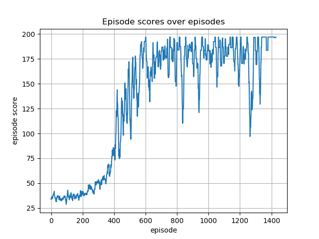

# CartPole

This example is a recreation of the classic [CartPole](https://gym.openai.com/environments/classic_control/cart_pole/)
problem in [Webots](https://cyberbotics.com), as seen in [OpenAI's gym](https://gym.openai.com/).

Various solutions to the problem are provided, with discrete and continuous action spaces. 
[PyTorch](https://pytorch.org/) is used as the backend neural network library. 
Discrete and continuous action space cases are split because switching between them requires several modifications 
on both the robot and the supervisor controllers.

Examples utilize both the [emitter - receiver scheme](https://github.com/aidudezzz/deepbots#emitter---receiver-scheme) and the 
[robot - supervisor scheme](https://github.com/aidudezzz/deepbots#combined-robot-supervisor-scheme) and act as basic examples of 
[deepbots framework](https://github.com/aidudezzz/deepbots) in use.

***More CartPole examples can always be added/contributed using other algorithms/backends.***

----

### Discrete action space

The discrete action space case is solved with a custom implementation of the
[Proximal Policy Optimization Reinforcement (PPO) Learning (RL) algorithm](https://openai.com/blog/openai-baselines-ppo/), 
both with the emitter - receiver 
([supervisor script](./cartpole_discrete/controllers/supervisor_manager/supervisor_controller.py), [robot script](./cartpole_discrete/controllers/robot_controller/robot_controller.py)) and 
robot supervisor ([robot - supervisor script](./cartpole_discrete/controllers/robot_supervisor_manager/robot_supervisor.py)) schemes. 

Moreover, a solution using 
[StableBaselines3 is provided](./cartpole_discrete/controllers/robot_supervisor_manager_Stable_Baselines/PPO_runner.py). 

You can find the corresponding .wbt world files to open in Webots [here](./cartpole_discrete/worlds/).

----

### Continuous action space

The continuous action space case is solved with a custom implementation of the 
[Deep Deterministic Policy Gradient RL algorithm](https://arxiv.org/abs/1509.02971), 
both with the emitter - receiver 
([supervisor script](./cartpole_continuous/controllers/supervisor_manager/supervisor_controller.py), [robot script](./cartpole_continuous/controllers/robot_controller/robot_controller.py)) and 
robot supervisor ([robot - supervisor script](./cartpole_continuous/controllers/robot_supervisor_manager/robot_supervisor.py)) schemes. 

You can find the corresponding .wbt world files to open in Webots [here](./cartpole_continuous/worlds/).

----

### Contents
- [CartPole discrete](./cartpole_discrete)
  - [supervisor](./cartpole_discrete/controllers/supervisor_manager/), [robot](./cartpole_discrete/controllers/robot_controller/), [custom PPO](./cartpole_discrete/controllers/supervisor_manager/agent/PPO_agent.py)
  - [robot - supervisor](./cartpole_discrete/controllers/robot_supervisor_manager), [custom PPO](./cartpole_discrete/controllers/robot_supervisor_manager/agent/PPO_agent.py)
  - [robot - supervisor with StableBaselines3](./cartpole_discrete/controllers/robot_supervisor_manager_Stable_Baselines/)
- [CartPole continuous](./cartpole_continuous)
  - [supervisor](./cartpole_continuous/controllers/supervisor_manager/), [robot](./cartpole_continuous/controllers/robot_controller/), [custom DDPG](./cartpole_continuous/controllers/supervisor_manager/agent/DDPG_agent.py)
  - [robot - supervisor](./cartpole_continuous/controllers/robot_supervisor_manager), [custom DDPG](./cartpole_continuous/controllers/robot_supervisor_manager/agent/DDPG_agent.py)

----

### Showcase of trained discrete PPO agent

Trained agent in action:

Reward per episode plot:

