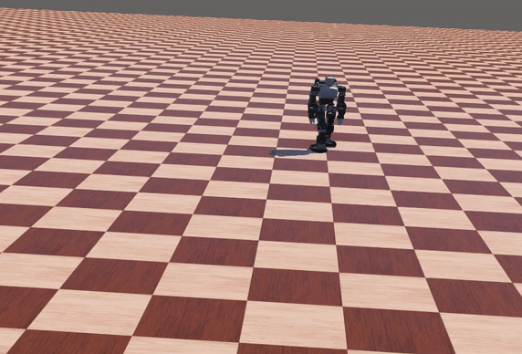
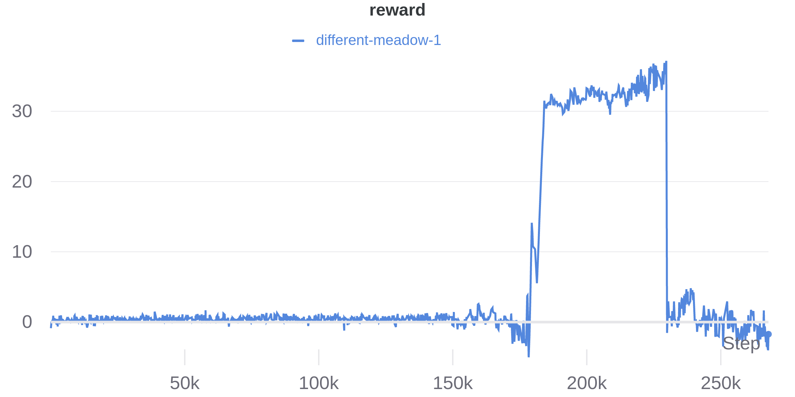

# khr-3hv: Robot-Supervisor

This example is a recreation of the [Humanoid](https://www.gymlibrary.ml/environments/mujoco/humanoid/) problem using the updated version of the [*deepbots framework*](https://github.com/aidudezzz/deepbots) with the 
[robot-supervisor scheme](https://github.com/aidudezzz/deepbots#combined-robot-supervisor-scheme).

We create the [humanoid](https://www.gymlibrary.ml/environments/mujoco/humanoid/) agent by the use of [khr-3hv](https://www.cyberbotics.com/doc/guide/khr-3hv) Robot from [Webots](https://cyberbotics.com/) simulator. To learn the agent to walk as far as possible. 

Two [Proximal Policy Optimization](https://openai.com/blog/openai-baselines-ppo/) (PPO) solutions of the problem are provided. One is with [Stable-Baselines](https://stable-baselines3.readthedocs.io/en/master/modules/ppo.html)  and the other is with [Ray](https://docs.ray.io/en/master/rllib-algorithms.html#ppo).

Switching between [Stable-Baselines](https://stable-baselines3.readthedocs.io/en/master/modules/ppo.html) and [Ray](https://docs.ray.io/en/master/rllib-algorithms.html#ppo) requires setting  `USE_RAY` to `False` or `True`.

## Contents
* [khr-3hv_continuous](https://github.com/aidudezzz/deepworlds/tree/dev/examples/khr-3hv)

## Solved Humanoid - PPO continuous

Trained agent showcase:

Reward per episode plot:

