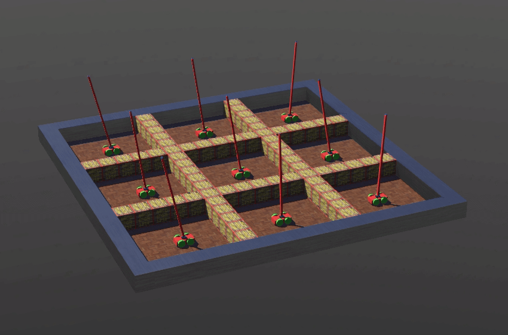

# Multi Cartpole

This example is a modified version of the classic [Cartpole](https://www.gymlibrary.ml/environments/classic_control/cart_pole/) problem in Reinforcement Learning in [Webots](https://cyberbotics.com/).It builds upon the 

## Environment Details

* The environment consists of of 9 cartpole robots placed in a 3D grid world.
* Each robot works independently of the others. 
* A reward of +1 is received for each time step **all** carts manage to keep their poles upright
* An episode ends when any one of the carts looses the balance of it's pole
* The environment is solved when the average of 100 most recent episodes exceeds 195.0

## Implementation Details

* This example is a depiction of how the [Emitter-Receiver scheme](https://github.com/aidudezzz/deepbots#emitter---receiver-scheme) can be used to communicate between a central controller and multiple robots.
* The included solution uses a PPO policy with both the actor and the critic shared across all the agents.

## Contents

* [Controllers](./controllers/)
* [Worlds](./worlds/)

## Graphics

Training using PPO (shared actor and shared critic)

