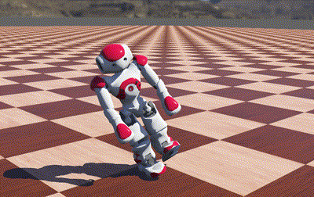
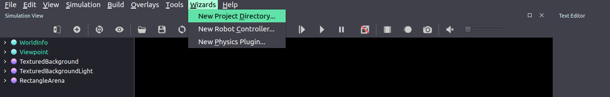
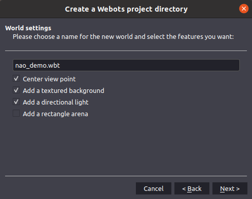
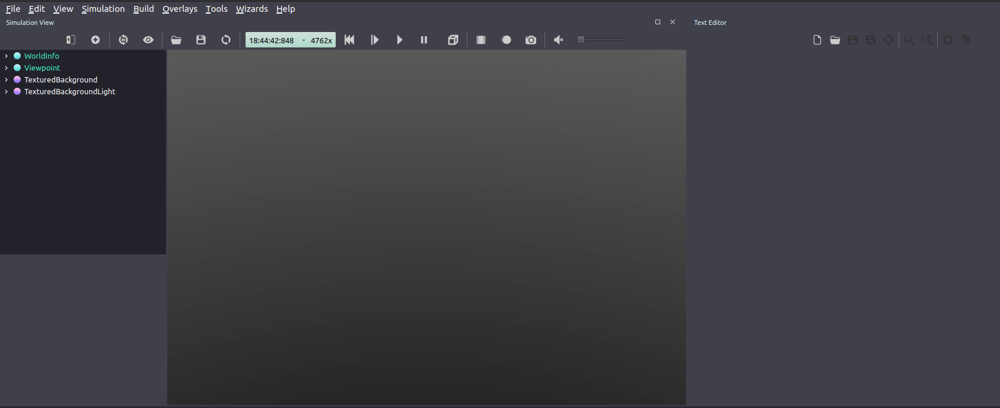
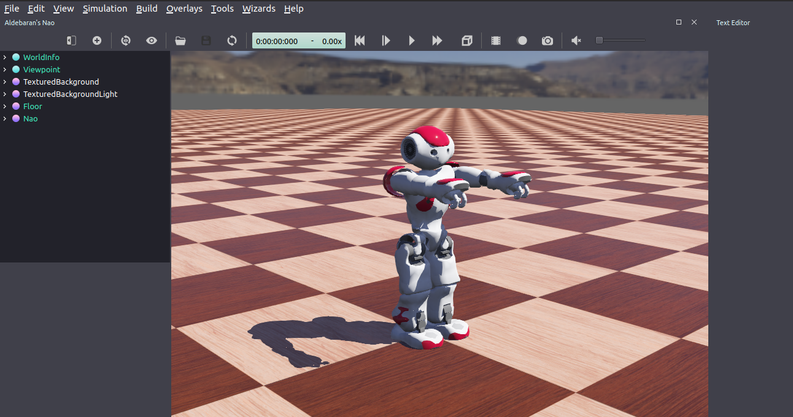
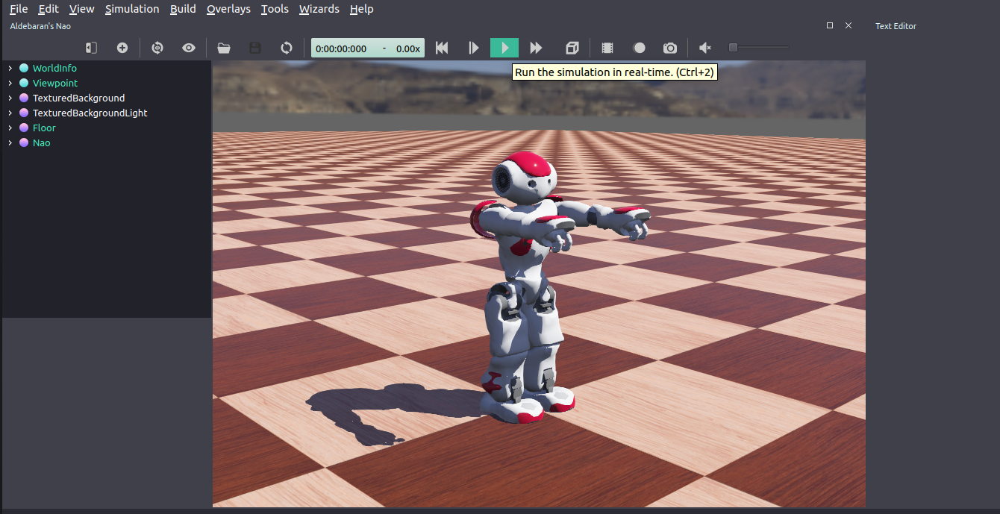

# Nao: Robot-Supervisor Tutorial



This tutorial shows the creation of the [humanoid](https://gym.openai.com/envs/Humanoid-v2/) problem using the updated
version of the [*deepbots framework*](https://github.com/aidudezzz/deepbots), utilizing the 
[robot-supervisor scheme](https://github.com/aidudezzz/deepbots#combined-robot-supervisor-scheme).

The first parts of the tutorial are identical to the 
[deepbots CartPole tutorial](https://github.com/aidudezzz/deepbots-tutorials/tree/master/robotSupervisorSchemeTutorial) that, also, uses the 
[robot-supervisor scheme](https://github.com/aidudezzz/deepbots#combined-robot-supervisor-scheme). The tutorial doesn't assume any familiarity with the [Webots](https://cyberbotics.com/) simulator.

We will create  the [humanoid](https://gym.openai.com/envs/Humanoid-v2/) agent step-by-step, by the use of [Nao](https://www.cyberbotics.com/doc/guide/nao) Robot from
[Webots](https://cyberbotics.com/) simulator. To learn the agent to walk as far as possible. We will incorporate the 
[Proximal Policy Optimization](https://openai.com/blog/openai-baselines-ppo/) (PPO) algorithm, using the [Stable-Basilens](https://stable-baselines3.readthedocs.io/en/master/modules/ppo.html) framework.
Also, it is possible the use of [Ray](https://docs.ray.io/en/master/rllib-algorithms.html#ppo) PPO (setting True the hyperparameter useRay).


You can check the complete example [here](https://github.com/aidudezzz/deepworlds/tree/dev/examples/nao) with all the scripts and nodes  used in this tutorial.
The Nao example is available on the [deepworlds](https://github.com/aidudezzz/deepworlds/) repository.


## Prerequisites

If you wish you could use the deepbot [docker](https://github.com/aidudezzz/deepbots/tree/dev/docker) for greater ease of use.  

_Please note that this tutorial targets the newest deepbots release (0.1.3) which is currently in development,
you can install the dev version with this command:_

`pip install -i https://test.pypi.org/simple/ deepbots`_

Other needed libraries:

`pip install gym==0.17.2
numpy==1.19.2
tensorflow==2.5.0
stable-baselines3
ray==1.2.0
torch==1.8.1
wandb`

 
## Creating the project on Webots

First of all, we should create a new project.

1. Open Webots and on the menu bar, click *"Wizards -> New Project Directory..."*\
    
2. Select a directory of your choice
3. On world settings, give your world a name, e.g. "nao_demo.wbt"  \
    
4. Press Next
5. Press Finish.
6. You should see this:\
   

7. Then download the nao_demo [world](https://github.com/aidudezzz/deepworlds/blob/dev/examples/nao/worlds/nao_demo.wbt) and replace it with the *created* one (on path: project-name/worlds).
8. Press the refresh button on Webots. Then you should end up with this:\
   


### Adding the controllers

First you have to download the [controllers](https://github.com/aidudezzz/deepworlds/tree/dev/examples/nao/controllers) and add those files on the path: project-name/controllers.

So the structures of the files should be:
* controllers folder
  * supervisorsManager folder 
    * python files

### Code overview

Before starting explaining the code, we take a look at the general workflow of the framework.

On the *supervisorsManager* we declare the value of each hyperparameter
for the PPO algorithm. We store all those hyperparameters on a class, *ModelArgs*,  for more compact use of them. Also, on this file exist some general variables (i.e., the name on the Wandb project, the use of Ray or Stable Baseline, etc.). 

Then from this file, we call the run function of *PPORun*. Where we declare the use of stable Baseline or the Ray PPO, for the training or evaluation proccess.

Finally, on the *NaoEnv* file, we have implemented the basic methods of *get_observations*, *get_reward*, *is_done* , *apply_action* and *reset*. Those methods are based on the general standard environment as exists at the [OpenAI Gym](https://gym.openai.com/) framework. 
These methods compose the *environment* that the RL agent interacts with. 


### Explaining the files

Now we will explain the use of each function of each of the provided  files on the supervisorsManager folder.


### supervisorsManager

This is the main file of our project. In the below code, we declare the variables: 
1. Name of Wandb project.
2. Saving frequency on the Wandb. Note: smaller number of frequency implies latency on the algorithm.
3. Boolean value for *train* or *evaluation* phase.
4. Use of Ray (True) or Stable-Baseline (False) PPO.
5. Output folder.
```
PROJECT_NAME = "Test"
WANDB_SAVE_FREQ = 100 # Logging Frequency on wandb
TRAIN = True # Train or evaluate the model
USE_Ray = False # Use Ray or Stable-Baseline
OUTPUT  = 'results/' # Output dir
```
Then we declare the hyperparameters that are needed on PPO for both frameworks.

```python
lr = 1e-4
gamma = 0.995
gae_lambda =  0.95
clip_param =  0.2
```
In case of the that you would like to use the Ray. It is incorporating also the following hyperparameters.

```python
kl_coeff = 1.0
num_sgd_iter = 10
sgd_minibatch_size = 64
train_batch_size = 64
num_workers = 1
num_gpus = 0
batch_mode = "complete_episodes"
observation_filter ="MeanStdFilter"
```
Finally, on the main function. We print a *Hello* message to indicate the start of the algorithm. Then we pass on the parameters on the *ModelArgs* class for better compact use of them and we call the run function from the PPORun.

```python
    print("Hello")
    args = ModelArgs(lr=lr, gamma=gamma, gae_lambda=gae_lambda, 
                     clip_param=clip_param, kl_coeff=kl_coeff, 
                     num_sgd_iter=num_sgd_iter, 
                     sgd_minibatch_size=sgd_minibatch_size,
                     train_batch_size=train_batch_size, 
                     num_workers=num_workers, num_gpus=num_gpus,
                     batch_mode=batch_mode, 
                     observation_filter=observation_filter)
    
    PPORun.run(PROJECT_NAME, WANDB_SAVE_FREQ, TRAIN, USE_Ray,
               OUTPUT, args)
```


### Args
This file represents a python Class with the name *ModelArgs*. The use of this class is for better ease of use of the hyperparameters that are needed for the PPO algorithm. Some of those hyperparameters are common on the *Stable-Baseline* and *Ray*  framework (i.e., lr, gamma, gae_lamda, clip_param). All the others are only used by *Ray*. 
```python
class ModelArgs(object):
    def __init__(self, lr, gamma, gae_lambda, clip_param, kl_coeff,   num_sgd_iter,sgd_minibatch_size, train_batch_size, num_workers, num_gpus, batch_mode, observation_filter):

        self.lr = lr
        self.gamma = gamma
        self.gae_lambda = gae_lambda
        self.clip_param = clip_param
        self.kl_coeff = kl_coeff
        self.num_sgd_iter = num_sgd_iter
        self.sgd_minibatch_size = sgd_minibatch_size
        self.train_batch_size = train_batch_size
        self.num_workers = num_workers
        self.num_gpus = num_gpus
        self.batch_mode = batch_mode
        self.observation_filter = observation_filter
```

### PPORun

On the PPORun file exist the use of the two RL framework to train or evaluate the PPO algorithm. In addition , it is implemented a learning rate scheduler function (used by Stable-Baseline). Where it decreases the learning rate as time progressing.

```python
def linear_schedule(initial_value: float) -> Callable[[float], float]:
    """
    Linear learning rate schedule.

    :param initial_value:
    :return: current learning rate depending on remaining progress
    """
    if isinstance(initial_value, str):
        initial_value = float(initial_value)

    def func(progress_remaining: float) -> float:
        """
        Progress will decrease from 1 (beginning) to 0
        :param progress_remaining: (float)
        :return: (float)
        """
        return progress_remaining * initial_value

    return func               
```
On the run function, we check which of the two frameworks we are going to use.
By the use of Ray, we have to register the environment by the Ray function *register_env*, otherwise, there are compatibility errors. In addition, we declare the model hyperparameters and the stop criteria. 

```python
def run(projectName, wandbSaveFreq, train, useRay, output, args):

    if useRay:
        # Register the enviroment to be used by Ray
        register_env("Nao", lambda config: NaoRobotSupervisor(projectName, wandbSaveFreq, train, useRay))
        # Model hyperparameters
        model_config = {
                "env": "Nao",
                "model":{
                    "fcnet_hiddens": [256, 256],
                    "fcnet_activation": "relu", # tanh or relu
                },
                "lr": args.lr,
                "framework": "torch",
                "gamma": args.gamma,
                "lambda": args.gae_lambda,
                "clip_param": args.clip_param,
                "kl_coeff": args.kl_coeff,
                "num_sgd_iter": args.num_sgd_iter,
                "sgd_minibatch_size": args.sgd_minibatch_size,
                "horizon": 200,
                "train_batch_size": args.train_batch_size,
                "num_workers": args.num_workers,
                "num_gpus": args.num_gpus,
                "batch_mode": args.batch_mode,
                "observation_filter": args.observation_filter
                }
        # Stop criteria for training
        stop = {
                "timesteps_total": 100e6,
        }
```
In the case of *training* with Ray, we use the Ray Tune to run the PPOTrainer. The use of the callbacks function saves the weight of the model at each given timestep on the output folder. It is, also, outputs the learning curves on the wandb website. However, the use of the wandb needs to provide the path of the file that exists your wandb API key.

```python
if train:
    tune.run(ppo.PPOTrainer, 
        config=model_config, 
        stop=stop,
        callbacks=[WandbLoggerCallback(
            project=projectName,
            api_key_file="path-to/wandb.txt",
            log_config=True)],
            local_dir=output, 
            checkpoint_freq=wandbSaveFreq,
            checkpoint_at_end=True)
    ray.shutdown()
```

In the case of *evaluation* with Ray, we use the same hyperparameters that had been used for training. Moreover, we restore the weight of the timestep that we want. Then we create a new environment of Nao Robot and let the trained agent interact with it. When the episode termination criteria are satisfied, we print the accumulated reward and reset the environment.

```python
else:
    # Crate an agent having the predifined model hyperparameters
    agent = ppo.PPOTrainer(config=model_config)
    # Restore the train weights
    agent.restore("./results/trained-Agent")
    
    # Use the enviroment of nao Robot
    nao_env = NaoRobotSupervisor(projectName, wandbSaveFreqtrain, useRay) 
    # Reset the enviroment and test the trained agent
    obs = nao_env.reset()
    nao_env.episodeScore = 0
    while True:
        action, _states = agent.compute_action(obs)
        obs, reward, done, _ = nao_env.step(action)
        # Accumulate episode reward
        nao_env.episodeScore += reward  

        if done:
            print("Reward accumulated =", nao_env.episodeScore)
            nao_env.episodeScore = 0
            obs = nao_env.reset()
```
For the Stable-Baseline PPO *training*, we create an instance of the Nao Robot environment. We initiate the wandb with the provided project name. We use a callback function to save the weight of the model at each given timestep on the output folder. By the policy_kwargs we could specify the *activation* function and the neural net *size* of the model. Following, we check if the environment is compatible with the stable-baseline. Then we create the model with the provided hyperparameters and we train it.

```python
# Use the enviroment of nao Robot
nao_env = NaoRobotSupervisor(projectName, wandbSaveFreq, train, useRay) 

if train:
    # Init the wandb providing the project name
    wandb.init(project=projectName)
    
    # Save a checkpoint every 1000 steps
    checkpoint_callback = CheckpointCallback(save_freq=wandbSaveFreq, save_path=output, name_prefix=projectName)
    
    # Change the neural net size or the activation function
    policy_kwargs = dict(#activation_fn=th.nn.ReLU,
                net_arch=[dict(pi=[64, 64], vf=[64, 64])])
    
    # Check if the nao_env is compatible with Stable Baseline 
    check_env(nao_env) 
    # Declare PPO agent with predifined hyperparameters
    model = PPO("MlpPolicy", nao_env, verbose=1, policy_kwargs=policy_kwargs,
                clip_range=args.clip_param, gamma=args.gamma, gae_lambda=args.gae_lambda,
                learning_rate=args.lr)
    # Train the agent and use the callback function to save the agent weights at a given time
    model.learn(total_timesteps=100000000, callback=checkpoint_callback)
```

For the Stable-Baseline PPO *evaluation*, we restore the weight of the timestep that we want. Then we let the trained agent interact with the environment. When the episode termination criteria are satisfied, we print the accumulated reward and reset the environment.

```python
else:
    # Load the weights of a trained Agent
    model = PPO.load("./results/trained-Agent")

    # Reset the enviroment and test the trained agent
    obs = nao_env.reset()
    nao_env.episodeScore = 0
    while True:
        action, _states = model.predict(obs)
        obs, reward, done, _ = nao_env.step(action)
        # Accumulate episode reward
        nao_env.episodeScore += reward  

        if done:
            print("Reward accumulated =", nao_env.episodeScore)
            nao_env.episodeScore = 0
            obs = nao_env.reset()
```


### NaoEnv

In this file are implemented the below python functions:
1. *get_observations* which will create the *observation* for our agent in each step,
2. *get_reward* which will return the reward of the agent for each step,
3. *is_done* which will look for the episode done condition,
4. *get_default_observation* which is used by the *reset* method that the framework implements,
5. *apply_action* which will take the action provided by the agent and apply it to the robot by setting its  motors' speeds and velocities,
6. *setup_agent*, which initializes the 24 or 8  motors. Storing the references inside a list and setting the starting positions and velocities,
7. dummy implementations for *get_info* and *render* required by the *gym.Env* class that is inherited,


First, we set up the observation and action spaces on the init function. Also, we are using a time window of the 5, on the observation space. Like that we keep the last 5 observations that have occurred on each episode. So, the total observation space is 5 * 10 = 50.
```python
class NaoRobotSupervisor(RobotSupervisor):
    
    def __init__(self, projectName, wandbSaveFreq, train, useRay):
          super().__init__()
        # Time window of 5
        self.t = 5
        # Number of observations
        self.numObs = 10
        # Total observations
        self.obs = np.zeros(self.t * self.numObs)
        # Lower and maximum values on observation space
        lowObs = -np.inf * np.ones(self.t * self.numObs)
        maxObs = np.inf * np.ones(self.t * self.numObs)
        self.observation_space = Box(low=lowObs, high=maxObs, dtype=np.float64)
        # Lower and maximum values on action space
        lowAct = np.array([-1.18, -1.76, -0.08, -1.18, -1.76, -0.08])
        maxAct = np.array([0.91, 0.47, 2.10, 0.91, 0.47, 2.10])
        self.action_space = Box(low=lowAct, high=maxAct, dtype=np.float64)
```

The observation space makes up the agent's (or the neural network's) input size and values are defined by the table below. Those are the observations that we acquire on each time step of episode. Then on any new timestep we shift those to keep the last 5.

Num | Observation | Min | Max
----|-------------|-----|----
0 | Robot position x-axis | -Inf | Inf
1 | Robot position y-axis | -Inf | Inf
2 | Robot position z-axis | -Inf | Inf
3 | Robot velocity z-axis | 0    | +6.4
4 |	LAnklePitch | -inf | +inf
5 |	LHipPitch   | -inf | +inf
6 |	LKneePitch  | -inf | +inf
7 |	RAnklePitch | -inf | +inf
8 |	RHipPitch   | -inf | +inf
9 |	RKneePitch  | -inf | +inf

The action space of the agent is defined on the table below:

Num | actuators | Min | Max
----|-------------|-----|----
0 | LAnklePitch | -1.18 | +0.91
1 | LHipPitch   | -1.76 | +0.47
2 | LKneePitch  | -0.08 | +2.10
3 | RAnklePitch | -1.18 | +0.91
4 | RHipPitch   | -1.76 | +0.47
5 | RKneePitch  | -0.08 | +2.10
          

Then we use some robot components and logging variables

```python
# Set up various robot components
self.motor_velocity = 2.4
self.robot = self.getSelf() 
self.setup_agent()
self.motorPositionArr = np.zeros(6)
# Score accumulated during an episode
self.episodeScore = 0  
self.prev_pos = self.robot.getPosition()[2]

# Logging parameters
self.distance_walk = 0
self.save_freq = wandbSaveFreq
self.counterLoging = 0
self.train = train
self.projectName = projectName
self.useRay = useRay
```
On the *get_observations* function, we create the observation vector on each time step. The observations are the robot position (x,z,y), robot velocity, and the state of each motor. We log the needed variables on the wandb and we shift the last observation by one position. Using the Ray we don't log the below variables because Ray has its own logging. So it produces errors by wandb having two instances of the same project.

```python
def get_observations(self):
    motorPos = self.robot.getPosition()
    motorPos.append(self.robot.getVelocity()[2])

    self.distance_walk = max(self.distance_walk, self.robot.getPosition()[2])
    self.counterLoging +=1
    global GLOBAL_DISTANCE
    GLOBAL_DISTANCE = max(GLOBAL_DISTANCE, self.robot.getPosition()[2])
    # Logging on the wandb. When using Ray we don't use the custom logging because Ray has it own 
    # logging and produce compatiblity errors of two instaces of wandb.
    if self.counterLoging % self.save_freq == 0 and self.train and not self.useRay:
        #wandb.init(project=self.projectName, reinit=False)
        wandb.log({"Episode distance walked": self.distance_walk, 
                    "Current z position": self.robot.getPosition()[2],
                    "Globan distance walekd": GLOBAL_DISTANCE
                    })           
    
    motorPos.extend([i for i in self.motorPositionArr])
    # Shift the last 10 observations by one, on the time window of 5
    self.obs = shift(self.obs, -self.numObs, cval=np.NaN)
    self.obs[-self.numObs:] = motorPos

    return np.array(self.obs)
```
On the *get_reward* function, we calculate the reward of the agent. The reward award agent when moving forward on the z-axis. Also, we are using a second term so the agent moves further away from his previous position. Again, we log the below variables on the wandb only if we use Stable-Baseline.

```python
def get_reward(self, action): 
    reward = 2.5 * self.robot.getPosition()[2] + self.robot.getPosition()[2] - self.prev_pos 
    
    if self.counterLoging % self.save_freq == 0 and self.train and not self.useRay:
        wandb.log({"reward": reward,
                    "reward-1term-weight-pos": 2.5 * self.robot.getPosition()[2],
                    "reward-2term-diff-possition": self.robot.getPosition()[2] - self.prev_pos
                })

    self.prev_pos = self.robot.getPosition()[2]
    return reward 
```

On the *is_done* function, we check the termination criteria for each episode. If the criteria are satisfied return *True* otherwise it returns *False*.


```python
 def is_done(self):
    # Agent fall. From 0.5  i make it to 0.45 to see it it has better walking.
    if self.robot.getPosition()[1] < 0.19: 
        return True     
    # Agent walked out of the box
    if self.robot.getPosition()[2] > 15: 
        return True  
    return False
```

On the *get_default_observation* function, we return the default observation which is a zero vector in the shape of the observation space.

```python
def get_default_observation(self):
        self.prev_pos = 0
        self.obs = np.zeros(self.t * self.numObs)
        self.distance_walk = 0 

        return np.zeros(self.observation_space.shape[0])
```
On the *apply_action* function, we use the action list provided by the policy, which contains the next action to be executed by the robot. It contains a float number denoting the action. The corresponding motor position value is applied to each motor. In addition, we move the hands of the agent down close to torso.

```python
def apply_action(self, action):
   motorIndexes = [0, 1, 2, 3, 4, 5]

    for i, ac in zip(motorIndexes, action):
        self.motorPositionArr[i] += ac
        self.motorList[i].setVelocity(self.motor_velocity)
        self.motorList[i].setPosition(ac)
    
    # Move the two hands down 
    self.motorList[6].setPosition(1.0) 
    self.motorList[6].setVelocity(self.motor_velocity) 
    self.motorList[7].setPosition(1.0) 
    self.motorList[7].setVelocity(self.motor_velocity)
```
On the *setup_agent* function, we initializes the 24 (all) or 8 (leg, hands) motors, storing the references inside a list and setting the starting positions and velocities.

```python
def setup_agent(self): 
    self.motorList = RobotFunc.getAllMotors(self)
```

### RobotUtils

RobotUtils files use some functions for the simplification of the robotic environment. The first function is returning the moving motors of the robot. It could return all the components or just the legs.

```python
def getMotorNames(name_type='all'):
    if name_type == 'all':
        return ['HeadPitch','HeadYaw', 'LAnklePitch', 'LAnkleRoll', 'LElbowRoll',
        'LElbowYaw', 'LHipPitch', 'LHipRoll', 'LHipYawPitch', 'LKneePitch', 'LShoulderPitch',
        'LShoulderRoll','LWristYaw', 'RAnklePitch', 'RAnkleRoll', 'RElbowRoll', 'RElbowYaw',
        'RHipPitch', 'RHipRoll', 'RHipYawPitch', 'RKneePitch', 'RShoulderPitch', 'RShoulderRoll',
        'RWristYaw']
    elif name_type=='legs':
        return ['LAnklePitch', 'LHipPitch', 'LKneePitch',
                'RAnklePitch', 'RHipPitch', 'RKneePitch',
                'LShoulderPitch',"RShoulderPitch"]
```

The second function that we use is asking the components that are needed. In our environment settings. Then it is storing the references motors inside a list and setting the starting positions and velocities.

```python
 def getAllMotors(robot):
    """
    Get 24 (all) or 8 (leg, hands)  motors from the robot model.
    """
    # Get the motors names: all or legs
    motorNames = RobotFunc.getMotorNames('legs')
    
    motorList = []
    for motorName in motorNames:
        motor = robot.getDevice(motorName)	 # Get the motor handle
        motor.setPosition(float('inf'))  # Set starting position
        motor.setVelocity(0.0)  # Zero out starting velocity
        motorList.append(motor) # Append motor to motorList
    return motorList
```

The last function that currently it is not needed. Is normalize the values to a given range. This function would be used in the future where we will train an agent on a specific robot and we will evaluate the trained agent on another robot. For this case, it will be needed to normalize the action space on a specific range.

```python
def normalizeToRange(value, minVal, maxVal, newMin, newMax, clip=False):
    value = float(value)
    minVal = float(minVal)
    maxVal = float(maxVal)
    newMin = float(newMin)
    newMax = float(newMax)

    if clip:
        return np.clip((newMax - newMin) / (maxVal - minVal) * (value - maxVal) + newMax, newMin, newMax)
    else:
        return (newMax - newMin) / (maxVal - minVal) * (value - maxVal) + newMax
```

### Conclusion

Now you can click on the *Run the simulation* button and watch the training run!
 


Webots allow to speed up the simulation, even run it without graphics.
The training could take some time, for 8 hours to 2 days for better results. In addition, you can even apply forces 
in real-time by pressing Alt - left-click and drag on the robot or the pole.

Note: To achieve faster results you could use the GPU and select *No rendering* on the Webtos.

That's it for this tutorial! :)


**_We welcome you to leave comments and feedback for the tutorial on the relevant 
[discussions page](https://github.com/aidudezzz/deepbots-tutorials/discussions/12) or to open an issue for any 
problem you find in it!_**